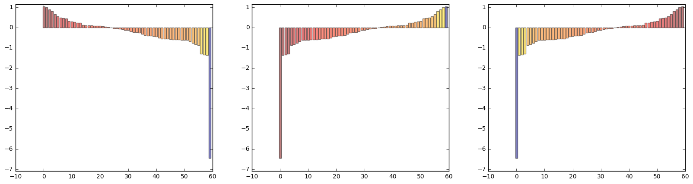

[使用matplotlib时fontList.py3k.cache not found问题解决](http://www.jianshu.com/p/10ae80a36f68)<br />
[Python 中 matplotlib 绘制格式化一：子图（subplots）、标记、颜色、轴](http://blog.topspeedsnail.com/archives/760)<br />
[Matplotlib绘图双纵坐标轴设置及控制设置时间格式](https://segmentfault.com/a/1190000006158803)<br />

```python
# -*- coding: utf-8 -*-
import matplotlib.pyplot as plt
import matplotlib.colors as col
import matplotlib.cm as cm
import numpy as np

# input data
#mean_values = np.random.randint(1, 101, 60)
mean_values = [1.05, 1.01, 0.9, 0.82, 0.67, 0.55, 0.5, 0.48,
               0.46, 0.33, 0.3, 0.29, 0.24, 0.23, 0.14, 0.12,
               0.1, 0.1, 0.09, 0.08, 0.08, 0.07, 0.05, 0.02,
               0.01, -0.03, -0.04, -0.07, -0.08, -0.13, -0.13, -0.18,
               -0.22, -0.24, -0.26, -0.31, -0.38, -0.39, -0.41, -0.43,
               -0.45, -0.5, -0.54, -0.55, -0.55, -0.57, -0.59, -0.59,
               -0.6, -0.61, -0.62, -0.62, -0.68, -0.77, -0.83, -0.86,
               -1.29, -1.34, -1.36, -6.45]
x_pos = range(len(mean_values))


fig = plt.figure(figsize=(20, 5))

# create colormap
cmap = cm.ScalarMappable(col.Normalize(min(mean_values),
                                       max(mean_values),
                                       cm.hot))

# plot bars, subplot中131表示位于1行3列的第1列
plt.subplot(131)
# 棒棒横纵坐标, 居中对齐, 透明度, 颜色
plt.bar(x_pos, mean_values, align='center', alpha=0.5,
        color=cmap.to_rgba(mean_values))
# 设置画板Y轴坐标
plt.ylim(min(mean_values) * 1.1, max(mean_values) * 1.1)

plt.subplot(132)
plt.bar(x_pos, np.sort(mean_values), align='center', alpha=0.5,
        color=cmap.to_rgba(mean_values))
plt.ylim(min(mean_values) * 1.1, max(mean_values) * 1.1)

plt.subplot(133)
plt.bar(x_pos, np.sort(mean_values), align='center', alpha=0.5,
        color=cmap.to_rgba(np.sort(mean_values)))
plt.ylim(min(mean_values) * 1.1, max(mean_values) * 1.1)

plt.show()
```





```python

```
