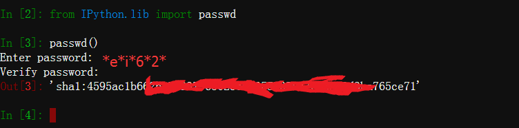

### 安装Ipython Notebook
```bash
pip3 install jupyter
jupyter
```
### 设置Ipython Notebook密码
```python
from IPython.lib import passwd
passwd()
```

### 配置Ipython Notebook服务
```bash
jupyter profile create MarkServer
vi /root/.ipython/profile_MarkServer/ipython_notebook_config.py
```
### ipython_notebook_config.py内容
```python
# Start config
c = get_config()                                    
c.IPKernelApp.pylab = 'inline'
# IP & port
c.NotebookApp.ip='You server IP as 123.123.123.123'
c.NotebookApp.port = 'You server port as 6789'
# Dot't open browser
c.NotebookApp.open_browser = False
# The hash of password
c.NotebookApp.password = u'sha1:XXXXXX:XXXXXXX'
```
### 远程服务器启动服务
```bash
jupyter notebook --config=/root/.ipython/profile_MarkServer/ipython_notebook_config.py
```
### 连接公网的客户机登陆
[http://123.123.123.123:6789/tree/Home#](http://123.123.123.123:6789/tree/Home#)<br />